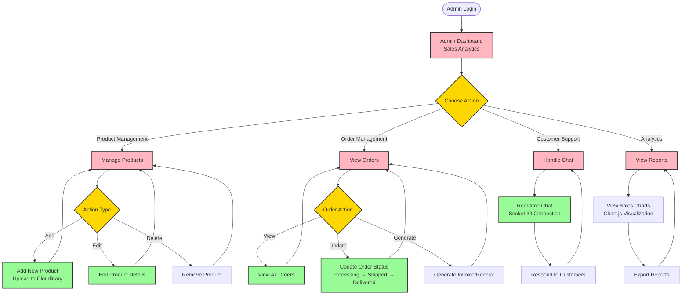
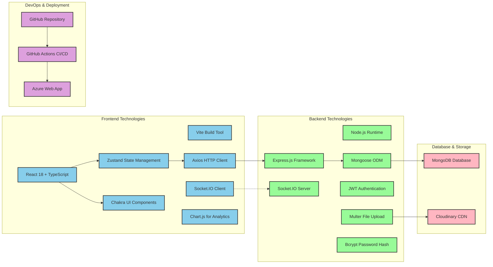

# Depo79 E-Commerce Platform - System Architecture Diagram

This document contains a comprehensive Mermaid diagram that illustrates the complete architecture and data flow of the Depo79 E-Commerce platform.

## System Architecture Overview

```mermaid
graph TB
    %% External Services
    subgraph "External Services"
        CLOUD[Cloudinary<br/>Image Storage]
        AZURE[Azure Web App<br/>Hosting]
        MONGO_ATLAS[MongoDB Atlas<br/>Database]
    end

    %% Client Layer
    subgraph "Client Layer"
        BROWSER[Web Browser]
        MOBILE[Mobile Browser]
    end

    %% Frontend Application
    subgraph "Frontend - React TypeScript App (Port 5173)"
        subgraph "UI Components"
            NAVBAR[Navigation Bar]
            SIDEBAR[Mobile Drawer]
            THEME[Theme Toggle]
        end
        
        subgraph "Customer Pages"
            HOME[Home Page]
            PRODUCTS[Product Listing]
            DETAIL[Product Detail]
            CART_PAGE[Shopping Cart]
            CHECKOUT_PAGE[Checkout]
            PROFILE_PAGE[User Profile]
            CHAT_PAGE[Customer Chat]
            ORDER_STATUS[Order Status]
        end
        
        subgraph "Admin Pages"
            ADMIN_HOME[Admin Dashboard]
            ADMIN_PRODUCTS[Product Management]
            ADMIN_ORDERS[Order Management]
            ADMIN_USERS[User Management]
            ADMIN_ANALYTICS[Sales Analytics]
            ADMIN_CHAT[Admin Chat]
        end
        
        subgraph "State Management (Zustand)"
            AUTH_STORE[Auth Store]
            CART_STORE[Cart Store]
            PRODUCT_STORE[Product Store]
            PROFILE_STORE[Profile Store]
            CHECKOUT_STORE[Checkout Store]
        end
        
        subgraph "Services & Utils"
            API_CLIENT[Axios API Client]
            SOCKET_CLIENT[Socket.IO Client]
            AUTH_UTILS[JWT Utils]
        end
    end

    %% Backend Application
    subgraph "Backend - Node.js Express Server (Port 5000)"
        subgraph "API Routes"
            AUTH_ROUTES["/api/auth<br/>Login, Register, JWT"]
            PRODUCT_ROUTES["/api/product<br/>CRUD Operations"]
            CART_ROUTES["/api/cart<br/>Cart Management"]
            CHECKOUT_ROUTES["/api/checkout<br/>Order Processing"]
            PROFILE_ROUTES["/api/profile<br/>User Management"]
            ADMIN_ROUTES["/api/protected<br/>Admin Only"]
            CHAT_ROUTES["/api/chat<br/>Messaging"]
        end
        
        subgraph "Controllers"
            AUTH_CTRL[Auth Controller]
            PRODUCT_CTRL[Product Controller]
            CART_CTRL[Cart Controller]
            ORDER_CTRL[Order Controller]
            USER_CTRL[User Controller]
            CHAT_CTRL[Chat Controller]
        end
        
        subgraph "Middleware"
            JWT_MIDDLEWARE[JWT Authentication]
            ADMIN_MIDDLEWARE[Admin Authorization]
            RATE_LIMITER[Rate Limiting]
            CORS_MIDDLEWARE[CORS Handler]
        end
        
        subgraph "Services"
            SOCKET_SERVICE[Socket.IO Service<br/>Real-time Chat]
            CLOUDINARY_SERVICE[Cloudinary Service<br/>Image Upload]
            EMAIL_SERVICE[Nodemailer Service<br/>Notifications]
        end
    end

    %% Database Layer
    subgraph "MongoDB Database"
        subgraph "Collections"
            USERS_COL[(Users Collection)]
            PRODUCTS_COL[(Products Collection)]
            CARTS_COL[(Carts Collection)]
            ORDERS_COL[(Orders/Checkout Collection)]
            REVIEWS_COL[(Reviews Collection)]
            CHATS_COL[(Chat Messages Collection)]
            CATEGORIES_COL[(Categories Collection)]
            ADDRESSES_COL[(Addresses Collection)]
        end
    end

    %% Connections
    BROWSER --> NAVBAR
    MOBILE --> SIDEBAR
    
    %% Frontend to Backend API
    API_CLIENT --> AUTH_ROUTES
    API_CLIENT --> PRODUCT_ROUTES
    API_CLIENT --> CART_ROUTES
    API_CLIENT --> CHECKOUT_ROUTES
    API_CLIENT --> PROFILE_ROUTES
    API_CLIENT --> ADMIN_ROUTES
    API_CLIENT --> CHAT_ROUTES
    
    %% Real-time connections
    SOCKET_CLIENT -.-> SOCKET_SERVICE
    CHAT_PAGE -.-> SOCKET_SERVICE
    ADMIN_CHAT -.-> SOCKET_SERVICE
    
    %% Backend to Database
    AUTH_CTRL --> USERS_COL
    PRODUCT_CTRL --> PRODUCTS_COL
    CART_CTRL --> CARTS_COL
    ORDER_CTRL --> ORDERS_COL
    USER_CTRL --> USERS_COL
    CHAT_CTRL --> CHATS_COL
    
    %% External Services
    CLOUDINARY_SERVICE --> CLOUD
    SOCKET_SERVICE --> AZURE
    MONGO_ATLAS --> USERS_COL
    MONGO_ATLAS --> PRODUCTS_COL
    MONGO_ATLAS --> CARTS_COL
    MONGO_ATLAS --> ORDERS_COL
    
    %% State Management Flow
    AUTH_ROUTES --> AUTH_STORE
    PRODUCT_ROUTES --> PRODUCT_STORE
    CART_ROUTES --> CART_STORE
    PROFILE_ROUTES --> PROFILE_STORE
    CHECKOUT_ROUTES --> CHECKOUT_STORE

    %% Styling
    classDef external fill:#ff9999,stroke:#333,stroke-width:2px
    classDef frontend fill:#87CEEB,stroke:#333,stroke-width:2px
    classDef backend fill:#98FB98,stroke:#333,stroke-width:2px
    classDef database fill:#FFB6C1,stroke:#333,stroke-width:2px
    classDef realtime fill:#DDA0DD,stroke:#333,stroke-width:2px
    
    class CLOUD,AZURE,MONGO_ATLAS external
    class HOME,PRODUCTS,CART_PAGE,ADMIN_HOME,AUTH_STORE,API_CLIENT frontend
    class AUTH_ROUTES,PRODUCT_CTRL,JWT_MIDDLEWARE,SOCKET_SERVICE backend
    class USERS_COL,PRODUCTS_COL,CARTS_COL,ORDERS_COL database
    class SOCKET_CLIENT,SOCKET_SERVICE,CHAT_PAGE realtime
```

## Customer User Journey Flow

```mermaid
flowchart TD
    START([Customer Visits Website]) --> BROWSE[Browse Products]
    BROWSE --> SEARCH{Search/Filter Products?}
    SEARCH -->|Yes| FILTER[Apply Filters<br/>Category, Price, etc.]
    SEARCH -->|No| VIEW[View Product List]
    FILTER --> VIEW
    VIEW --> SELECT[Select Product]
    SELECT --> DETAIL_VIEW[View Product Details<br/>Images, Description, Reviews]
    DETAIL_VIEW --> ADD_CART{Add to Cart?}
    ADD_CART -->|Yes| CART_UPDATED[Cart Updated<br/>Zustand Store]
    ADD_CART -->|No| BROWSE
    CART_UPDATED --> CONTINUE{Continue Shopping?}
    CONTINUE -->|Yes| BROWSE
    CONTINUE -->|No| CHECKOUT_START[Go to Checkout]
    CHECKOUT_START --> LOGIN_CHECK{User Logged In?}
    LOGIN_CHECK -->|No| LOGIN[Login/Register]
    LOGIN_CHECK -->|Yes| ADDRESS[Select/Add Address]
    LOGIN --> ADDRESS
    ADDRESS --> PAYMENT[Choose Payment Method]
    PAYMENT --> REVIEW[Review Order]
    REVIEW --> PLACE_ORDER[Place Order]
    PLACE_ORDER --> ORDER_SUCCESS[Order Confirmation]
    ORDER_SUCCESS --> TRACK[Track Order Status]
    TRACK --> CHAT{Need Support?}
    CHAT -->|Yes| CUSTOMER_CHAT[Real-time Chat<br/>with Admin]
    CHAT -->|No| END([Process Complete])
    CUSTOMER_CHAT --> END

    %% Styling
    classDef process fill:#87CEEB,stroke:#333,stroke-width:2px
    classDef decision fill:#FFD700,stroke:#333,stroke-width:2px
    classDef endpoint fill:#98FB98,stroke:#333,stroke-width:2px
    
    class BROWSE,VIEW,DETAIL_VIEW,CART_UPDATED,ADDRESS,PAYMENT,REVIEW,PLACE_ORDER process
    class SEARCH,ADD_CART,CONTINUE,LOGIN_CHECK,CHAT decision
    class START,ORDER_SUCCESS,END endpoint
```

## Admin Management Flow

## Technology Stack & Integrations

## Key Features Summary

### Customer Features
- **Product Browsing**: Search, filter, and view construction materials
- **Shopping Cart**: Add/remove items with persistent state
- **User Authentication**: JWT-based login/register system
- **Order Management**: Checkout process and order tracking
- **Real-time Chat**: Customer support via Socket.IO
- **Responsive Design**: Mobile-friendly interface
- **Theme Support**: Light/dark mode toggle

### Admin Features
- **Dashboard Analytics**: Sales reports with Chart.js visualizations
- **Product Management**: CRUD operations for inventory
- **Order Processing**: View and update order statuses
- **Customer Support**: Real-time chat management
- **User Management**: View customer information
- **Content Management**: Handle reviews and categories

### Technical Features
- **Real-time Communication**: Socket.IO for instant messaging
- **Image Management**: Cloudinary integration for product photos
- **Security**: JWT authentication, bcrypt password hashing, rate limiting
- **Performance**: Compression, caching, optimized build process
- **Deployment**: Automated CI/CD with GitHub Actions to Azure
- **State Management**: Zustand for predictable state updates
- **Type Safety**: Full TypeScript implementation

This architecture ensures scalability, maintainability, and excellent user experience for both customers and administrators of the Depo79 e-commerce platform.