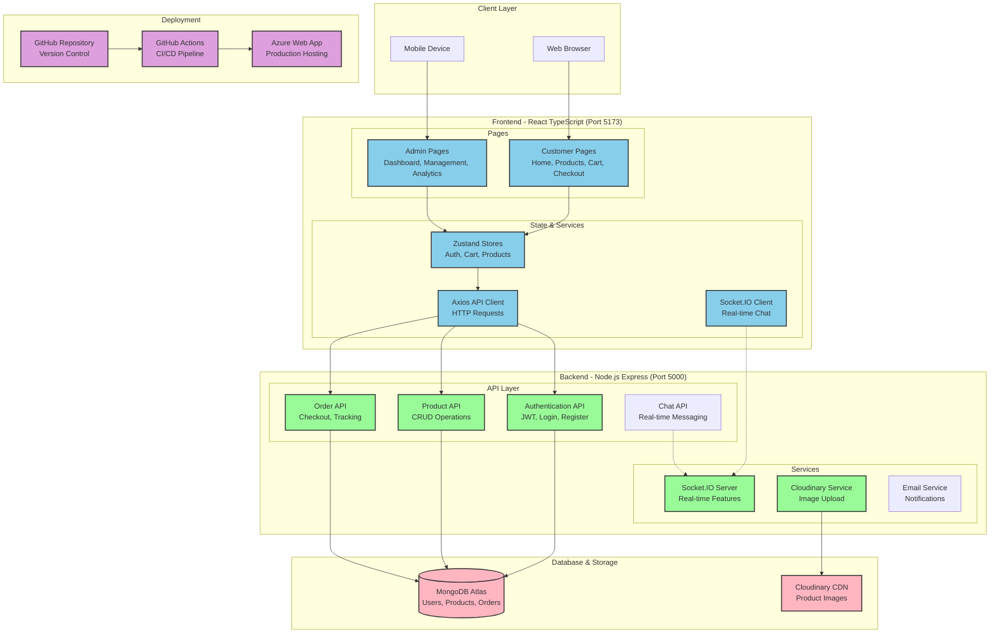

# Depo79 E-Commerce Web Platform

A modern e-commerce web application built with the MERN stack (MongoDB, Express.js, React, Node.js) for construction materials retail. Developed as part of an internship project at Azka Group Malang.

## 🌐 Live Demo

The application is now deployed and available online:

**Website URL:** [Depo79 E-Commerce Platform](https://internship-bngefpfzewbrd8dw.southeastasia-01.azurewebsites.net)

## Badges

[](https://choosealicense.com/licenses/mit/)
[](https://opensource.org/licenses/)
[](http://www.gnu.org/licenses/agpl-3.0)
[](https://internship-bngefpfzewbrd8dw.southeastasia-01.azurewebsites.net)
[](https://nodejs.org/)
[](https://reactjs.org/)
[](https://www.mongodb.com/)

## 📋 Table of Contents
- [Features](#-features)
- [Project Architecture](#-project-architecture)
- [Tech Stack](#-tech-stack)
- [Project Structure](#-project-structure)
- [API Documentation](#-api-documentation)
- [Installation & Setup](#️-installation--setup)
- [Configuration](#-configuration)
- [Usage Examples](#-usage-examples)
- [Deployment & CI/CD](#-deployment--cicd)
- [Contributing](#-contributing)
- [Troubleshooting](#-troubleshooting)
- [License](#license)
- [Contact & Feedback](#contact--feedback)

## 🌟 Features

### Customer Features
- 🛒 Shopping cart management
- 💳 Multiple payment methods integration
- 🔍 Advanced product search and filtering
- 💬 Real-time chat support
- 🌓 Light/dark mode toggle
- ⭐ Product reviews and ratings
- 📱 Responsive design for all devices
- 📍 Address management for delivery

### Admin Features
- 📊 Dashboard analytics
- 📦 Product management
- 🚚 Order tracking
- 👥 Customer management
- 💰 Sales reports
- 📝 Review management
- 🗃️ Category and weight management
- 🧾 Invoice generation and management

## 🏗 Project Architecture

Depo79 follows a modern MERN stack architecture with clear separation of concerns:

### 📊 Complete System Architecture Diagram

For a comprehensive view of the entire system architecture, including detailed component interactions, user flows, and technology integrations, please refer to our detailed Mermaid diagrams in [ARCHITECTURE_DIAGRAM.md](./ARCHITECTURE_DIAGRAM.md).

### High-Level Architecture Overview



### Architecture Components

- **Frontend**: React application with TypeScript, Zustand for state management, and Chakra UI for styling
- **Backend**: Node.js and Express server with REST API endpoints and Socket.IO for real-time features
- **Database**: MongoDB for storing products, users, orders and other application data
- **Authentication**: JWT-based authentication system with role-based access control
- **Real-time Features**: Socket.IO for instant messaging and live updates
- **Cloud Storage**: Cloudinary for product image storage and optimization
- **Deployment**: Azure Web App with automated CI/CD via GitHub Actions

## 🚀 Tech Stack

### Frontend
- **React** with TypeScript for UI building
- **Zustand** for state management
- **Chakra UI** & **TailwindCSS** for styling
- **Vite** as build tool
- **Axios** for API requests
- **Socket.IO Client** for real-time chat functionality
- **React Icons** for UI icons
- **Framer Motion** for animations

### Backend
- **Node.js** with **Express** for server logic
- **MongoDB** with **Mongoose** for database
- **JWT** for authentication
- **Socket.IO** for real-time features
- **Nodemailer** for email notifications
- **Cloudinary** for image storage
- **Multer** for file uploads
- **Bcrypt.js** for password hashing
- **Morgan** for request logging
- **Helmet** for security
- **Compression** for response compression

## 📁 Project Structure

```
/d:/E-Commerce/
├── .github/                # GitHub workflows for CI/CD
│   └── workflows/          # GitHub Actions configurations
├── backend/                # Backend Node.js application
│   ├── config/             # Database and app configurations
│   ├── controllers/        # Request handlers
│   ├── middleware/         # Express middlewares
│   ├── models/             # Mongoose data models
│   ├── routes/             # API route definitions
│   ├── services/           # Business logic services
│   └── server.js           # Express application entry point
├── depo79/                 # Frontend React application
│   ├── public/             # Static files
│   ├── src/                # React source code
│   │   ├── components/     # UI components
│   │   ├── context/        # React context providers
│   │   ├── hooks/          # Custom React hooks
│   │   ├── pages/          # Application pages
│   │   ├── services/       # API service integration
│   │   ├── store/          # State management
│   │   ├── styles/         # CSS and styling
│   │   └── utils/          # Utility functions
│   ├── index.html          # HTML entry point
│   └── vite.config.ts      # Vite configuration
├── package.json            # Project dependencies and scripts
└── README.md               # Project documentation
```

## 📝 API Documentation

### Authentication Endpoints
- `POST /api/auth/register`: Register new user
- `POST /api/auth/login`: Authenticate user and return token
- `POST /api/auth/logout`: Log out user
- `GET /api/auth/me`: Get current authenticated user

### Product Endpoints
- `GET /api/product`: Retrieve all products
- `GET /api/product/:id`: Get product by ID
- `POST /api/product`: Create new product (admin only)
- `PUT /api/product/:id`: Update product (admin only)
- `DELETE /api/product/:id`: Delete product (admin only)

### Cart Endpoints
- `GET /api/cart`: Get user's cart
- `POST /api/cart`: Add item to cart
- `PUT /api/cart/:itemId`: Update cart item
- `DELETE /api/cart/:itemId`: Remove item from cart

### Order/Checkout Endpoints
- `POST /api/checkout`: Create new order
- `GET /api/checkout/:id`: Get order details
- `GET /api/checkout/history`: Get user's order history

### Category & Weight Endpoints
- `GET /api/kategori`: Get all categories
- `GET /api/Berat`: Get all weight options

### User Profile & Address Endpoints
- `GET /api/profile`: Get user profile
- `PUT /api/profile`: Update user profile
- `GET /api/alamat`: Get user addresses
- `POST /api/alamat`: Add new address

### Admin Endpoints
- `GET /api/protected/admin/users`: Get all users (admin only)
- `GET /api/protected/admin/orders`: Get all orders (admin only)
- `PUT /api/protected/admin/orders/:id`: Update order status (admin only)

### Chat Endpoints
- `GET /api/chat`: Get user's chat history
- `POST /api/chat`: Send new message

## ⚙️ Installation & Setup

### Prerequisites
- Node.js (v20-lts or higher)
- MongoDB
- npm or yarn

### Complete Setup Instructions

1. **Clone the repository**
   ```bash
   git clone <repository-url>
   cd E-Commerce
   ```

2. **Install backend dependencies**
   ```bash
   npm install
   ```

3. **Install frontend dependencies**
   ```bash
   cd depo79
   npm install
   cd ..
   ```

4. **Set up environment variables**
   - Create a `.env` file in the root directory with the following variables:
   ```
   NODE_ENV=development
   PORT=8080
   MONGO_URI=<your-mongodb-connection-string>
   JWT_SECRET=<your-jwt-secret>
   CLOUDINARY_CLOUD_NAME=<your-cloudinary-name>
   CLOUDINARY_API_KEY=<your-cloudinary-api-key>
   CLOUDINARY_API_SECRET=<your-cloudinary-api-secret>
   EMAIL_USER=<your-email-for-notifications>
   EMAIL_PASS=<your-email-password>
   FRONTEND_URL=http://localhost:5173
   ```
   - Create a `.env` file in the `depo79` directory with:
   ```
   VITE_TURNSTILE_SITEKEY=<your-cloudflare-turnstile-sitekey>
   VITE_API_URL=http://localhost:5000/api
   ```

5. **Start development server**
   ```bash
   # Start backend server with hot reload
   npm run dev
   
   # In another terminal, start frontend
   cd depo79
   npm run dev
   ```

6. **Access the application**
   - Backend: http://localhost:5000
   - Frontend: http://localhost:5173

## ⚙ Configuration

### Environment Variables

#### Backend (root `.env` file)
| Variable | Description |
|----------|-------------|
| NODE_ENV | Environment (development/production) |
| PORT | Server port (default: 5000) |
| MONGO_URI | MongoDB connection string |
| JWT_SECRET | Secret for JWT token generation |
| CLOUDINARY_* | Cloudinary credentials for image storage |
| EMAIL_USER | Email for sending notifications |
| EMAIL_PASS | Email password or app password |
| FRONTEND_URL | URL of the frontend application |
| ADMIN_SECRET_KEY | Secret key for admin registration |

#### Frontend (`depo79/.env` file)
| Variable | Description |
|----------|-------------|
| VITE_TURNSTILE_SITEKEY | Cloudflare Turnstile site key for bot protection |
| VITE_API_URL | API URL for frontend to connect to backend |

## 📸 Usage Examples

### Customer Journey
1. **Browse products**: Users can browse through the available construction materials
2. **Search and filter**: Filter products by category, price, or search by name
3. **Add to cart**: Select items and add them to the shopping cart
4. **Checkout process**: 
   - Review cart
   - Enter shipping address
   - Select payment method
   - Complete order

### Admin Dashboard
1. **Inventory management**: Add, edit or remove products
2. **Order processing**: View orders and update their status
3. **Customer management**: View customer information and order history
4. **Analytics**: View sales reports and statistics

## 🔄 Deployment & CI/CD

The application is automatically deployed to Azure Web App using GitHub Actions:
- Continuous Integration with GitHub Actions workflow
- Automatic deployment to Azure on push to main branch
- Optimized build process for production environment

### Deploy Manually
To deploy the application manually:

1. Build the frontend
   ```bash
   cd depo79
   npm run build
   cd ..
   ```

2. Start the production server
   ```bash
   NODE_ENV=production npm start
   ```

## 👥 Contributing

We welcome contributions to improve Depo79 E-Commerce Platform!

1. Fork the repository
2. Create a feature branch (`git checkout -b feature/amazing-feature`)
3. Commit your changes (`git commit -m 'Add some amazing feature'`)
4. Push to the branch (`git push origin feature/amazing-feature`)
5. Open a Pull Request

### Coding Standards
- Use ESLint for code linting
- Follow the existing code style
- Write unit tests for new features
- Update documentation for significant changes

## ❓ Troubleshooting

### Common Issues

**Frontend can't connect to backend API**
- Check if backend server is running
- Verify `.env` file configuration
- Ensure CORS is properly configured

**MongoDB connection issues**
- Check MongoDB connection string
- Ensure MongoDB service is running
- Check network connectivity

**Image uploads not working**
- Verify Cloudinary credentials
- Check file size limits
- Ensure proper MIME types are allowed

**Socket.IO connection issues**
- Check if backend Socket.IO service is initialized
- Verify frontend Socket.IO connection URL
- Check browser console for connection errors

## Contact & Feedback

If you have any feedback or questions, please reach out to us at muh4mm4dh4r1z@gmail.com

## License

[MIT](https://choosealicense.com/licenses/mit/)


